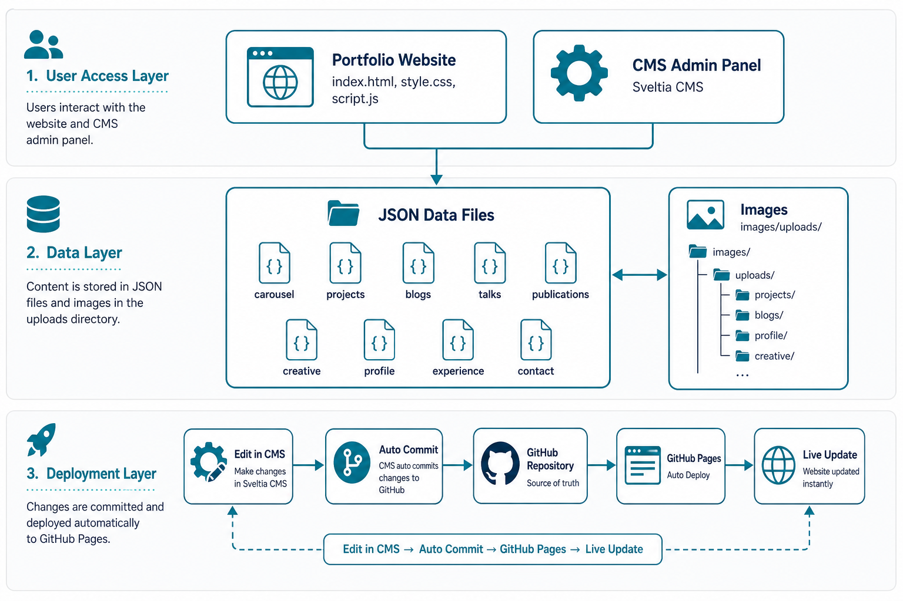

# Joyce Pan | Data + AI Portfolio


个人作品集展示站点，基于纯前端技术栈（HTML + CSS + JavaScript）构建，集成 Sveltia CMS 可视化内容管理系统。用于展示个人项目、公开分享、博客文章、工作经历等内容，支持中英文双语切换。

**无需编写代码，通过浏览器后台即可管理全站内容。**

## 预览

| 类型 | 地址 |
|------|------|
| 🌐 站点主页 | https://sharp-007.github.io/joyce.github.io/ |
| ⚙️ CMS 后台 | https://sharp-007.github.io/joyce.github.io/admin/ |

## 项目架构



**核心设计理念：** 内容与代码分离，通过 CMS 可视化编辑 JSON 数据，自动同步到 GitHub 并触发部署。

## CMS 后台管理优势

### 🎯 为什么选择可视化 CMS？

| 传统方式 | CMS 可视化管理 |
|---------|---------------|
| 需要编辑 JSON 文件 | 表单式编辑，所见即所得 |
| 需要了解文件结构 | 分类清晰的管理面板 |
| 手动 git commit/push | 自动提交到 GitHub |
| 图片需手动上传到正确目录 | 拖拽上传，自动分类存储 |
| 容易出现 JSON 语法错误 | 表单验证，杜绝格式错误 |
| 需要本地开发环境 | 浏览器直接访问后台 |

### ✨ 核心特性

- **🖱️ 拖拽排序** — 内容顺序可视化调整，无需修改代码
- **🖼️ 图片预览** — 上传即预览，所有图片统一管理
- **🌐 双语编辑** — 中英文字段并排显示，方便对照编辑
- **📱 响应式后台** — 手机、平板也能管理内容
- **🔐 GitHub 授权** — 基于 OAuth 的安全登录机制
- **⚡ 即时生效** — 编辑完成后网站自动更新

### 📋 支持管理的内容模块

| 模块 | 说明 | 可编辑字段 |
|------|------|-----------|
| 🎠 首页走马灯 | 首页高亮展示 | 标题、副标题、封面、链接 |
| 💼 项目 | 个人项目展示 | 标题、描述、封面、链接、技能标签、重点标记 |
| 📝 博客 | 微信公众号文章 | 标题、封面、链接、发布日期 |
| 🎤 公开分享 | 技术分享、演讲、会议 | 类型、标题、封面、链接、日期、标签 |
| 📚 发表作品 | 专利、论文 | 类型、标题、作者、来源、年份、链接、PDF |
| 🎨 创意作品 | AI创作、音乐视频 | 标题、描述、技术栈、视频链接、音乐链接 |
| 👤 个人简介 | Hero 区域 | 姓名、头像、标语、简介、证书、技能、社交链接 |
| 💼 工作经历 | 时间线展示 | 类型、时间、公司、Logo、职位、工作亮点 |
| 📞 联系方式 | 页脚联系 | 标题、副标题、社交链接、二维码 |

## 项目结构

```
joyce.github.io/
├── index.html              # 主页面（静态框架 + 动态容器）
├── style.css               # 全局样式（主题色、卡片、时间线等）
├── script.js               # 交互逻辑 + 数据驱动渲染
├── data/                   # 📁 模块化内容数据（JSON）
│   ├── carousel.json       #    首页走马灯
│   ├── projects.json       #    项目（含技能标签）
│   ├── blogs.json          #    博客文章
│   ├── talks.json          #    公开分享（技术分享、演讲、会议等）
│   ├── publications.json   #    发表作品（白皮书、专利、论文）
│   ├── creative.json       #    创意作品（AI创作、音乐视频）
│   ├── profile.json        #    个人简介（头像、技能、社交链接）
│   ├── experience.json     #    工作经历与教育背景
│   └── contact.json        #    联系方式（社交链接、二维码）
├── admin/                  # ⚙️ Sveltia CMS 可视化管理后台
│   ├── index.html          #    CMS 入口页面
│   └── config.yml          #    CMS 配置（集合、字段、媒体设置）
├── images/                 # 📷 图片资源
│   └── uploads/            #    统一图片目录（CMS 上传）
│       ├── projects/       #    项目封面
│       ├── talks/          #    公开分享封面
│       ├── logos/          #    公司/学校 Logo
│       ├── blogs/          #    博客封面
│       ├── profile/        #    个人头像
│       ├── qrcodes/        #    二维码图片
│       └── *.png           #    其他上传图片
├── .gitignore              # Git 忽略配置
└── README.md               # 项目文档
```

## 功能特性

### 🎨 前端展示

- **中英文双语切换** — 一键切换全站语言，所有文案支持双语
- **响应式设计** — 完美适配桌面端、平板、移动端
- **主题色视觉系统** — 统一的青绿色渐变主题，品牌化视觉体验
- **技能标签关联** — 项目和公开分享卡片显示相关技能标签
- **视频嵌入** — 支持 YouTube / Bilibili 双源一键切换
- **平滑滚动与动画** — 基于 Intersection Observer 的淡入效果
- **时间线布局** — 工作经历与教育背景采用专业时间线设计

### ⚙️ 内容管理

- **可视化 CMS** — 集成 Sveltia CMS，浏览器后台直接管理内容
- **数据驱动渲染** — 内容存储在 JSON 文件，页面自动动态渲染
- **图片统一管理** — 所有图片按分类存储在 `images/uploads/` 目录
- **拖拽排序** — 可视化调整内容顺序
- **自动同步** — 编辑保存后自动 commit 到 GitHub，网站即时更新

### 🚀 部署特性

- **纯静态架构** — 无需后端服务，零运维成本
- **GitHub Pages** — 免费托管，自动 HTTPS
- **即时部署** — 代码推送后自动构建部署

## 部署指南

### 方式一：GitHub Pages（推荐）

1. **创建 GitHub 仓库**
  在 GitHub 上新建一个仓库，仓库名为 `joyce.github.io`。
2. **推送代码到仓库**
  ```bash
   git remote add origin https://github.com/sharp-007/joyce.github.io.git
   git branch -M main
   git push -u origin main
  ```
3. **开启 GitHub Pages**
  - 进入仓库页面 → **Settings** → **Pages**
  - **Source** 选择 `Deploy from a branch`
  - **Branch** 选择 `main`，目录选择 `/ (root)`
  - 点击 **Save**
4. **访问站点**
  等待 1-2 分钟后，即可通过以下地址访问：
   `https://sharp-007.github.io/joyce.github.io/`

### 方式二：自定义域名（可选）

1. 在仓库 **Settings → Pages → Custom domain** 中填写你的域名（如 `www.example.com`）
2. 在域名 DNS 服务商处添加记录：
  - **CNAME** 记录：`www` → `sharp-007.github.io`
  - 或 **A** 记录指向 GitHub Pages IP 地址：
    ```
    185.199.108.153
    185.199.109.153
    185.199.110.153
    185.199.111.153
    ```
3. 勾选 **Enforce HTTPS**

### 方式三：本地预览

由于项目为纯静态文件，可直接在本地用任意 HTTP 服务器预览：

```bash
# 使用 Python
python -m http.server 8000

# 使用 Node.js (npx)
npx serve .

# 使用 VS Code
# 安装 Live Server 插件，右键 index.html → Open with Live Server
```

然后在浏览器访问 `http://localhost:8000`。

## 内容管理（Sveltia CMS）

网站集成了 [Sveltia CMS](https://github.com/sveltia/sveltia-cms)，这是一个现代化的 Git-based CMS，相比 Decap CMS 具有更好的图片预览支持和用户体验。

### 在线使用（推荐）

1. 访问 CMS 后台：`https://sharp-007.github.io/joyce.github.io/admin/`
2. 点击 **Login with GitHub** 授权登录
3. 在可视化界面中添加/编辑内容（支持拖拽排序、图片上传）
4. 点击 **Save** 发布，CMS 自动将修改 commit 到 GitHub 仓库
5. GitHub Pages 自动重新部署，主页约 1-2 分钟后更新

### CMS 操作演示

```
┌─────────────────────────────────────────────────────────────┐
│  Sveltia CMS                                    [Publish ▼] │
├─────────────────────────────────────────────────────────────┤
│ Collections          │  项目 Projects                       │
│ ─────────────────    │  ────────────────────────────────    │
│ 🎠 首页走马灯         │  [+ New] [Sort ↕]                    │
│ 💼 项目 ←            │                                      │
│ 📝 博客              │  ┌─────────────────────────────────┐ │
│ 🎤 公开分享          │  │ 📷 Industrial ChatBI Platform   │ │
│ 📚 发表作品          │  │ ⭐ Featured                      │ │
│ 🎨 创意作品          │  │ Python, SQL, LLM, ChatBI        │ │
│ 👤 个人简介          │  └─────────────────────────────────┘ │
│ 💼 工作经历          │  ┌─────────────────────────────────┐ │
│ 📞 联系方式          │  │ 📷 Industrial Defect Detection  │ │
│                      │  │ ⭐ Featured                      │ │
│ Media                │  │ Python, PyTorch, YOLO           │ │
│ 📁 images/uploads    │  └─────────────────────────────────┘ │
└─────────────────────────────────────────────────────────────┘
```

### 本地开发使用

```bash
# 1. 安装并启动本地代理（可选，用于本地调试）
npx decap-server

# 2. 在另一个终端启动本地 HTTP 服务器
npx serve .

# 3. 在 admin/config.yml 中设置 local_backend: true
# 4. 访问 http://localhost:3000/admin/ 即可本地编辑
```

### GitHub OAuth 配置（完整指南）

在线使用 CMS 需要配置 GitHub OAuth，以下是完整配置步骤：

#### 步骤 1：部署 OAuth 代理服务

推荐使用免费的 [Sveltia CMS Auth](https://github.com/sveltia/sveltia-cms-auth)（Cloudflare Worker 方案）：

1. 访问 [Sveltia CMS Auth](https://github.com/sveltia/sveltia-cms-auth)
2. 点击 **"Deploy to Cloudflare"** 按钮
3. 登录 Cloudflare 账号，完成一键部署
4. 部署成功后获得 Worker URL，格式如：`https://sveltia-cms-auth.xxx.workers.dev`

#### 步骤 2：创建 GitHub OAuth App

1. 访问 [GitHub Developer Settings](https://github.com/settings/developers)
2. 点击 **OAuth Apps** → **New OAuth App**
3. 填写以下信息：

| 字段 | 值 |
|------|-----|
| Application name | `Joyce Portfolio CMS`（任意名称） |
| Homepage URL | `https://sharp-007.github.io/joyce.github.io/` |
| Authorization callback URL | `https://你的Worker地址/callback` |

4. 点击 **Register application**
5. 创建成功后，复制 **Client ID**
6. 点击 **Generate a new client secret**，复制 **Client Secret**（只显示一次）

#### 步骤 3：配置 Cloudflare 环境变量

1. 登录 [Cloudflare Dashboard](https://dash.cloudflare.com/)
2. 进入 **Workers & Pages** → 点击你的 Worker（如 `sveltia-cms-auth`）
3. 点击 **Settings** → **Variables and Secrets**
4. 添加两个环境变量：

| 变量名 | 值 |
|--------|-----|
| `GITHUB_CLIENT_ID` | 你的 GitHub OAuth Client ID |
| `GITHUB_CLIENT_SECRET` | 你的 GitHub OAuth Client Secret |

5. 点击 **Save and Deploy** 重新部署 Worker

#### 步骤 4：更新 CMS 配置

在 `admin/config.yml` 中配置 `base_url`：

```yaml
backend:
  name: github
  repo: sharp-007/joyce.github.io
  branch: main
  base_url: https://你的Worker地址
```

#### 步骤 5：测试 CMS

1. 推送更新后的 `config.yml` 到 GitHub
2. 等待 1-2 分钟 GitHub Pages 更新
3. 访问 `https://sharp-007.github.io/joyce.github.io/admin/`
4. 点击 **Login with GitHub** 授权登录

详见 [Sveltia CMS 文档](https://github.com/sveltia/sveltia-cms) 和 [Sveltia CMS Auth](https://github.com/sveltia/sveltia-cms-auth)。

### 图片管理

所有图片统一存储在 `images/uploads/` 目录下，按类型分类：

```
images/uploads/
├── projects/     # 项目封面图
├── talks/        # 公开分享封面图
├── logos/        # 公司/学校 Logo
├── blogs/        # 博客封面图
├── profile/      # 个人头像
├── qrcodes/      # 二维码图片
└── *.png         # 其他上传图片
```

CMS 后台支持：
- ✅ 拖拽上传图片
- ✅ 图片实时预览
- ✅ 自动存储到正确目录
- ✅ 支持 PNG/JPG/SVG 格式

## 自定义修改


| 修改内容 | 对应文件 | CMS 支持 |
| --- | --- | :---: |
| 首页走马灯 (Carousel) | `data/carousel.json` | ✅ |
| 精选项目 (Projects) | `data/projects.json` | ✅ |
| 博客文章 (Blog) | `data/blogs.json` | ✅ |
| 公开分享 (Talks) | `data/talks.json` | ✅ |
| 发表作品 (Publications) | `data/publications.json` | ✅ |
| 创意作品 (Creative) | `data/creative.json` | ✅ |
| 个人简介与核心技能 (Profile) | `data/profile.json` | ✅ |
| 工作经历与教育背景 (Experience) | `data/experience.json` | ✅ |
| 联系方式 (Contact) | `data/contact.json` | ✅ |
| 主题色、卡片样式 | `style.css` | ❌ |
| 交互逻辑、数据渲染 | `script.js` | ❌ |
| CMS 配置 | `admin/config.yml` | - |


## 技术栈

| 类别 | 技术 |
|------|------|
| 前端框架 | HTML5 + CSS3 + Vanilla JavaScript (ES6+) |
| 样式特性 | CSS Variables、Flexbox、Grid、动画、响应式设计 |
| 数据渲染 | Fetch API + JSON 数据驱动 |
| 内容管理 | [Sveltia CMS](https://github.com/sveltia/sveltia-cms)（Git-based CMS） |
| OAuth 代理 | [Sveltia CMS Auth](https://github.com/sveltia/sveltia-cms-auth)（Cloudflare Worker） |
| 字体 | Google Fonts（Inter + Noto Sans SC） |
| 部署 | GitHub Pages（自动 HTTPS） |
| 版本控制 | Git + GitHub |

## 快速开始

### 1. 克隆仓库

```bash
git clone https://github.com/sharp-007/joyce.github.io.git
cd joyce.github.io
```

### 2. 本地预览

```bash
# 使用 Python
python -m http.server 8000

# 或使用 Node.js
npx serve .
```

访问 `http://localhost:8000` 即可预览。

### 3. 自定义内容

- **通过 CMS**：部署后访问 `/admin/` 可视化编辑
- **直接编辑**：修改 `data/*.json` 文件

### 4. 部署到 GitHub Pages

1. Fork 或创建新仓库
2. 进入 **Settings → Pages**
3. 选择 **Deploy from branch** → `main` → `/ (root)`
4. 等待部署完成

## 联系与合作

欢迎 **Data+AI** / **Industrial AI** 项目合作；欢迎 **Vibe Coding** 项目合作与案例展示；欢迎 **AIGC短片制作** 项目合作。

_Open to **Data+AI** / **Industrial AI** projects collaboration; Open to **Vibe Coding** collaborations and case showcases; Open to **AIGC Short Film Production** projects collaboration. Let's connect!_

<table>
  <tr>
    <td align="center">
      <b>微信公众号 · 失控的智能</b><br>
      
    </td>
    <td align="center">
      <b>微信视频号 · AIPanda007</b><br>
      
    </td>
  </tr>
</table>

## License

&copy; 2026 Joyce Pan. All rights reserved.

---

<p align="center">
  <b>Made with ❤️ by Joyce Pan</b><br>
  <a href="https://sharp-007.github.io/joyce.github.io/">View Portfolio</a> · 
  <a href="https://sharp-007.github.io/joyce.github.io/admin/">Manage Content</a> · 
  <a href="https://github.com/sharp-007">GitHub Profile</a>
</p>