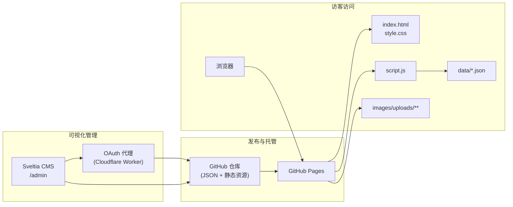

# Joyce Pan | Data + AI Portfolio

个人作品集站点：纯前端（HTML + CSS + JavaScript），展示项目、技术分享、博客、发表作品、创意作品与时间线经历等内容，支持中英文一键切换。

## 预览

GitHub Pages 部署地址：

```
https://sharp-007.github.io/joyce.github.io/
```

后台入口（需 GitHub 登录与 OAuth 配置）：

```
https://sharp-007.github.io/joyce.github.io/admin/
```

---

## 架构说明

站点采用 **静态页面 + JSON 数据驱动 + Git 托管内容** 的组合：主页不包含大量硬编码文案，核心区块由 `script.js` 读取 `data/*.json` 并注入 DOM；媒体资源集中在 `images/uploads/` 下按用途分子目录，便于 CMS 统一管理与预览。

### 架构示意



### 维护优势（为什么要配后台）

| 维度 | 说明 |
|------|------|
| **免改代码** | 改文案、封面图、排序多在 CMS 中完成，无需手改 `index.html` / `script.js`。 |
| **Git 即数据库** | 每次保存即一次提交，变更可追溯、可回滚，无需自建后端或数据库。 |
| **与静态托管契合** | 内容仍为仓库里的 JSON + 图片文件，GitHub Pages 重新构建/刷新后即可生效。 |
| **媒体集中管理** | 图片统一落在 `images/uploads/` 下（按 `projects` / `talks` / `logos` 等子目录分类），后台预览路径一致，减少「站外路径」问题。 |
| **配置即契约** | `admin/config.yml` 定义字段与集合，编辑界面与数据结构对齐，降低协作成本。 |

---

## 项目结构（当前）

```
joyce.github.io/
├── index.html              # 页面骨架与区块容器
├── style.css               # 全局样式（主题、卡片、时间线等）
├── script.js               # 语言切换、Fetch JSON、各区块渲染
├── data/                   # 站点内容数据（CMS 主要编辑对象）
│   ├── carousel.json       # 首页走马灯
│   ├── projects.json       # 项目（含技能标签、精选标记）
│   ├── blogs.json          # 博客条目
│   ├── talks.json          # 技术分享
│   ├── publications.json   # 发表作品（白皮书、专利、论文等）
│   ├── creative.json       # 创意作品
│   ├── profile.json        # 个人简介（头像、段落、徽章、技能、社交）
│   ├── experience.json     # 工作经历与教育背景时间线
│   └── contact.json        # 联系方式与二维码
├── admin/                  # 可视化管理后台
│   ├── index.html          # 加载 Sveltia CMS
│   └── config.yml          # 后台集合、字段与 media 路径配置
├── images/
│   └── uploads/            # 站点图片根目录（与 CMS media_folder 一致）
│       ├── projects/       # 项目封面等
│       ├── talks/          # 分享封面等
│       ├── logos/          # 机构 Logo、favicon 等
│       ├── blogs/          # 博客相关封面（若有）
│       ├── profile/        # 头像等
│       ├── qrcodes/        # 二维码图片
│       └── *.png 等        # 其他直接上传的配图（如创意封面）
├── publications/           # 发表作品 PDF 等资源（可选，与内容条目引用配合）
├── .gitignore
└── README.md
```

---

## 功能特性

- **中英文双语** — 一键切换，`data-*` 属性与 JSON 中英字段配合渲染。
- **响应式布局** — 适配桌面与移动端。
- **数据驱动渲染** — 走马灯、项目、博客、简介、经历等由 JSON 驱动，`script.js` 统一注入。
- **技能标签** — 项目与技术分享可配置标签，与展示卡片绑定。
- **视频双源** — 创意区块支持 YouTube / Bilibili 切换嵌入。
- **平滑动画** — Intersection Observer 淡入等交互。
- **纯静态交付** — 适合 GitHub Pages 与其它静态托管。
- **Git + 可视化 CMS** — 通过浏览器编辑 JSON 与上传图片，提交回仓库，实现可持续迭代。

---

## 部署指南

### 方式一：GitHub Pages（推荐）

1. 将本仓库推送到 GitHub（示例：`sharp-007/joyce.github.io`）。
2. 仓库 **Settings → Pages**：Source 选择分支（如 `main`），目录 **`/` (root)**。
3. 等待生效后访问：`https://sharp-007.github.io/joyce.github.io/`（若用户名/仓库名不同，请替换路径前缀）。

### 方式二：自定义域名（可选）

在 Pages 中配置 Custom domain，并在 DNS 配置 CNAME 指向 `用户名.github.io`（或使用文档要求的 A 记录），勾选 Enforce HTTPS。

### 方式三：本地预览

```bash
python -m http.server 8000
# 或
npx serve .
```

浏览器打开对应本地地址即可。**本地默认无法完成 GitHub OAuth 全流程**，完整 CMS 登录仍以线上 `/admin/` + 已部署 OAuth Worker 为准。

---

## 内容管理（Sveltia CMS）

后台使用 [Sveltia CMS](https://github.com/sveltia/sveltia-cms)（兼容 Netlify CMS / Decap 风格的 `config.yml`），通过 **GitHub 后端** 读写仓库中的 JSON 与 `images/uploads/`。

### 在线使用流程

1. 访问 `https://sharp-007.github.io/joyce.github.io/admin/`。
2. **Login with GitHub**，完成授权。
3. 在界面中编辑各集合条目或上传图片。
4. 保存后由后端生成 **commit** 推送至仓库。
5. GitHub Pages 更新后，主页读取最新 JSON / 静态资源。

### GitHub OAuth（概要）

在线编辑必须配置 OAuth，且 **Client Secret 不能暴露在前端**，因此需要代理服务（示例：仓库内配置的 [Sveltia CMS Auth](https://github.com/sveltia/sveltia-cms-auth) 部署在 Cloudflare Workers）。

1. 部署 Worker，得到 `base_url`（例如 `https://sveltia-cms-auth.xxx.workers.dev`）。
2. 在 GitHub **OAuth App** 中填写 Homepage URL 与 **Authorization callback URL**（`https://你的Worker域名/callback`）。
3. 在 Worker 环境变量中配置 `GITHUB_CLIENT_ID`、`GITHUB_CLIENT_SECRET`。
4. 在 `admin/config.yml` 的 `backend.base_url` 填入该 Worker 地址并推送。

当前示例配置中的仓库与站点域名请以自己的 fork 为准修改。

### CMS 集合与数据文件

| 模块 | 说明 | 数据文件 |
|------|------|----------|
| 首页走马灯 | 首页轮播卡片，支持排序 | `data/carousel.json` |
| 项目 | 含精选标记、技能标签、封面 | `data/projects.json` |
| 博客 | 微信公众号等外链条目 | `data/blogs.json` |
| 技术分享 | 课程/活动封面与链接 | `data/talks.json` |
| 发表作品 | 专利、论文、白皮书等 | `data/publications.json` |
| 创意作品 | MV、多平台链接与封面 | `data/creative.json` |
| 个人简介 | 头像、简介段落、徽章、技能、社交 | `data/profile.json` |
| 工作经历与教育 | 时间线与 Logo | `data/experience.json` |
| 联系方式 | 标题、社交链接、二维码图 | `data/contact.json` |

字段细节与控件类型以 `admin/config.yml` 为准。

---

## 自定义修改速查

| 修改目标 | 主要文件 | CMS |
|----------|-----------|:---:|
| 走马灯 / 项目 / 博客 / 分享 / 发表 / 创意 / 简介 / 经历 / 联系 | `data/*.json` | ✅ |
| 主题与布局 | `style.css` | ❌ |
| 渲染与交互逻辑 | `script.js` | ❌ |
| 后台菜单与字段 | `admin/config.yml` | - |
| 站点与 Logo（CMS 顶栏等） | `admin/config.yml`（`site_url`、`logo_url` 等） | - |

---

## 技术栈

- HTML5 / CSS3（变量、Flex、Grid、动画）
- 原生 JavaScript（Fetch、DOM 渲染）
- [Sveltia CMS](https://github.com/sveltia/sveltia-cms) + GitHub + OAuth 代理
- Google Fonts（Inter + Noto Sans SC）

---

## License

Copyright 2026 Joyce Pan. All rights reserved.
